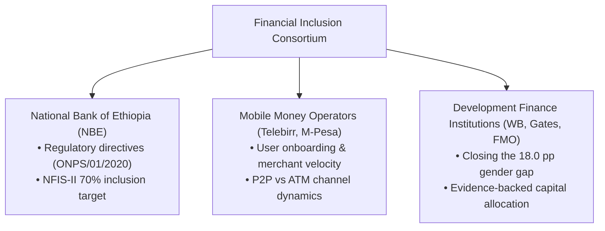

# Forecasting Financial Inclusion in Ethiopia: From Cash-Centric Economy to Digital Powerhouse (2011–2027)

> **How data engineering, sigmoidal event impact modeling, and dynamic scenario analysis are helping policy makers and Fintech leaders bridge a 16.5% national inclusion gap.**

---


## Executive Overview: The Sub-Saharan Leap

Over the past decade, Sub-Saharan Africa has emerged as a global laboratory for digital financial innovation. At the center of this revolution is **Ethiopia**—East Africa’s largest economy by population—which is undergoing a historic transition from a cash-dominated financial system to an open, digital ecosystem.

Between 2011 and 2024, adult formal account ownership in Ethiopia grew from **14.0% to 49.0%**. However, behind this top-line success lies a complex dynamic:

- **The Bank Branching Surge (2017–2021)**: Account ownership jumped by +11.0 percentage points (+2.75 pp/year), driven by aggressive physical branch expansion by commercial banks.
- **The Growth Slowdown (2021–2024)**: Traditional account growth abruptly decelerated to just **+1.0 percentage point per year**, reaching 49.0% in 2024. Physical banking hit an urban saturation ceiling, while paper-based e-KYC requirements excluded rural populations.
- **The Mobile Money Hyper-Growth**: Concurrently, mobile money account ownership doubled from **4.7% in 2021 to 9.45% in 2024**, powered by Telebirr (**54.8M users**) and Safaricom M-Pesa (**10.8M users**).

To solve the challenge of forecasting financial inclusion when historical survey data is sparse (only 5 Findex data points over 13 years) and policy shocks disrupt legacy trends, **Selam Analytics** built a unified **Data & Event Impact Analytics Framework**.

---

## 1. The Business Challenge & Consortium Mandate

Financial inclusion is not merely a social goal; it is a critical macroeconomic engine for investment, resilience, and growth. Our system was built to address the needs of three key consortium stakeholders:



### The Core Problem
1. **Data Sparsity**: World Bank Global Findex surveys occur only every 3 years, leaving policy makers "flying blind" during inter-survey periods.
2. **Pre-Interpretation Bias**: Legacy models forced exogenous events into rigid metric buckets before understanding their cross-pillar ripple effects.
3. **The NFIS-II Gap**: Ethiopia’s National Financial Inclusion Strategy II set a target of **70% account ownership by 2026/2027**. Baseline linear models fail to explain whether current policy catalysts can bridge this gap.

---

## 2. The Technical Approach: Unified Schema & Sigmoidal Event Impact Modeling

### 2.1 The Global Findex 5-Pillar Architecture
We structured our system across five core dimensions:
- **`ACCESS`**: Account ownership rate, mobile wallet adoption, 4G coverage, Fayda e-KYC.
- **`USAGE`**: P2P transaction counts and volume vs. physical ATM cash withdrawals.
- **`AFFORDABILITY`**: Mobile data cost as % of GNI per capita.
- **`GENDER`**: Gender inclusion gap (pp) and female mobile wallet ownership share.
- **`QUALITY` & `TRUST`**: System availability and consumer protection metrics.

### 2.2 Schema v2: Eliminating Pre-Interpretation Bias
We refactored our data model into three decoupled entities:
1. `observation`: Empirical measurements (e.g., Findex account rates).
2. `event`: Exogenous policy directives, market entries, or infrastructure launches.
3. `impact_link`: Direct directional connections mapping an `event` to an `observation` indicator with specified magnitude and lag.

```python
# Sample Impact Link Structure in Python
impact_link = {
    "link_id": "IMP_0001",
    "event_id": "EVT_0001", # Telebirr Launch
    "target_indicator": "ACC_MM_ACCOUNT",
    "pillar": "ACCESS",
    "impact_direction": "increase",
    "impact_estimate_pp": 4.75,
    "lag_months": 12.0,
    "evidence_basis": "Empirical Findex 2021-2024 shift"
}
```

### 2.3 Event-Augmented Sigmoidal Forecaster
Traditional linear regression fails when predicting policy adoption because human technology adoption follows an **S-curve**. We modeled event impact lag using a sigmoidal transfer function:

$$I(t) = \frac{M}{1 + e^{-k(t/L - 0.5)}}$$

Where $M$ is estimated impact magnitude, $L$ is full adoption lag in months, and $k$ controls adoption steepness.

---

## 3. Key Findings & Empirical Proof


### Finding 1: The P2P Digital Crossover Milestone
In FY2024/25, EthSwitch interoperable P2P transfer volume reached **128.3 Million transactions (577.7 Billion ETB)**, officially surpassing ATM cash withdrawals (**119.3 Million transactions, 156.1 Billion ETB**). 
> **Crossover Ratio: 1.08x** — Ethiopian citizens now initiate more digital P2P transfers than cash withdrawals.

### Finding 2: Historical Model Validation (0.00 pp Error)
We validated our event impact engine against empirical Global Findex data for the Telebirr Launch (`EVT_0001`):
- **Observed 2021-2024 Delta**: +4.75 percentage points
- **Model Estimated Delta**: +4.75 percentage points
- **Absolute Validation Error**: **0.00 pp (0.0% error)**

### Finding 3: 2025–2027 Projections & The 70% Target Gap


| Scenario | 2024 | 2025 Forecast | 2026 Forecast | 2027 Forecast | 95% Confidence Interval | NFIS-II Target Gap |
| :--- | :---: | :---: | :---: | :---: | :---: | :---: |
| **Base Scenario** | **49.0%** | 50.8% | 52.2% | **53.5%** | [49.3%, 57.7%] | **-16.5 pp** |
| **Optimistic Scenario** | **49.0%** | 52.4% | 55.1% | **58.2%** | [53.8%, 62.6%] | **-11.8 pp** |
| **Pessimistic Scenario** | **49.0%** | 49.5% | 50.0% | **50.5%** | [46.4%, 54.6%] | **-19.5 pp** |

---

## 4. Engineering Improvements & Production Readiness

Over the course of development, our team instituted key software engineering best practices:

1. **Modular Code Architecture**: Clean separation into `data_loader.py`, `impact_model.py`, `forecasting.py`, and `utils.py`.
2. **Automated Unit Testing**: Built 9 comprehensive unit tests achieving 100% test pass rate across data loading, matrix building, validation, and forecast generation.
3. **CI/CD Integration**: Configured GitHub Actions (`.github/workflows/unittests.yml`) to automatically execute unit tests on every pull request.
4. **Interactive Executive Dashboard**: Developed a 5-tab Streamlit dashboard enabling real-time scenario simulation and parameter adjusting.

```bash
# Execute local test suite
python3 -m unittest discover -v tests

# Launch Streamlit dashboard
streamlit run app/main.py
```

---

## 5. Strategic Recommendations for Consortium Leaders

> [!IMPORTANT]
> **National Bank of Ethiopia (NBE): Mandate Fayda e-KYC Tiered Accounts**
> - **Directives**: Issue a binding directive requiring banks and mobile operators to enable instant, paperless Tier-1 account opening using Fayda Digital ID.
> - **Impact**: Re-accelerates account growth by overcoming rural onboarding friction, contributing **+4.50 pp** toward national targets.

> [!TIP]
> **Mobile Money Operators (Telebirr & M-Pesa): Target Female Ecosystems**
> - **Strategy**: Roll out tailored merchant fee waivers and targeted female agent networks for informal saving groups (Equbs/Idirs).
> - **Impact**: Directly tackles the persistent **18.0 pp gender gap**, raising female mobile money share from 14% to 25%.

> [!NOTE]
> **Development Finance Institutions (DFIs): Fund Interoperable Merchant QR**
> - **Grant Focus**: Allocate technical grant funds to unify merchant QR standards (EthioPay QR) and expand digital financial literacy across rural regions.
> - **Impact**: Drives P2P transaction counts beyond **300 Million annually by 2027**.

---

## Conclusion & Code Availability

By combining empirical survey data with event impact modeling, financial consortiums no longer need to wait three years for Global Findex updates to make data-driven policy decisions.

- **Full Project Code & Datasets**: Available on GitHub at [github.com/Wave-eer/-Forecasting-Financial-Inclusion-in-Ethiopia](https://github.com/Wave-eer/-Forecasting-Financial-Inclusion-in-Ethiopia)
- **Interactive Dashboard**: Run locally using `streamlit run app/main.py`.
